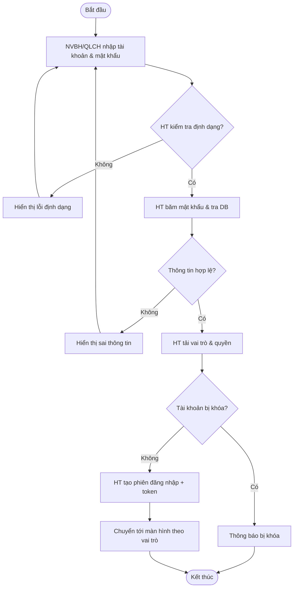
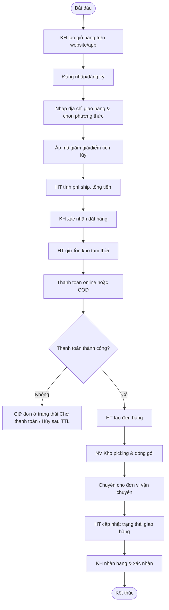
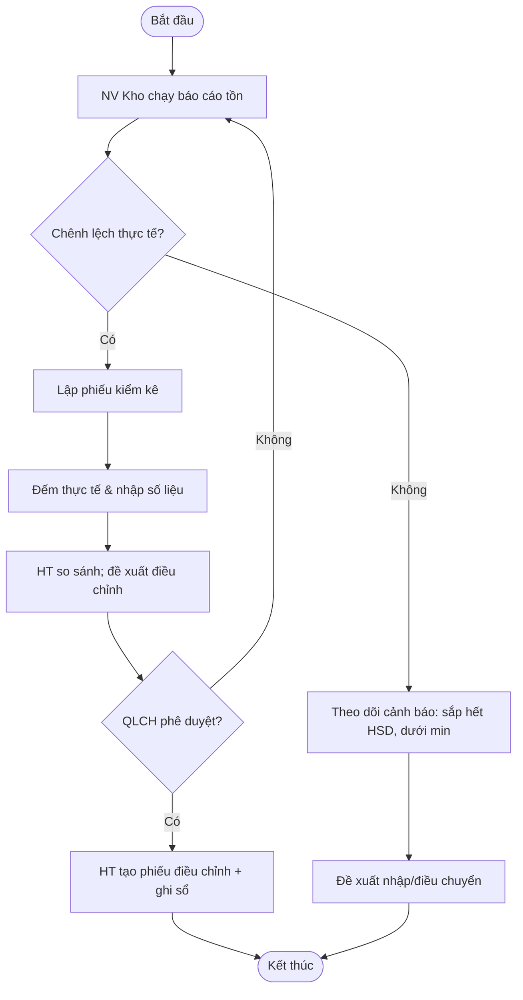
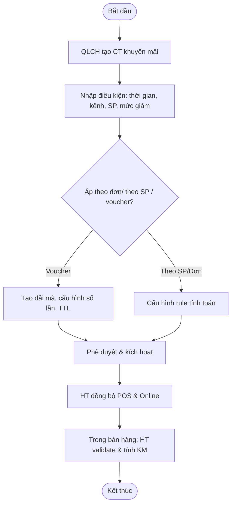
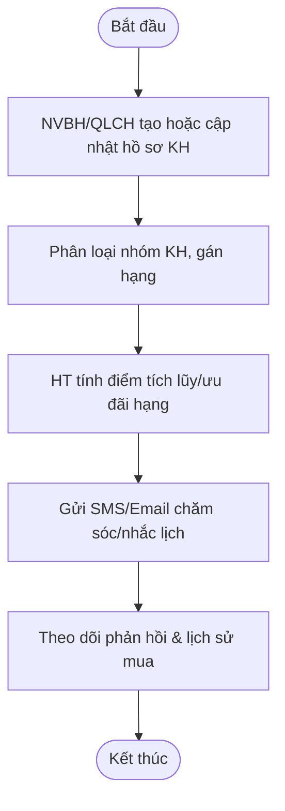

# Biểu đồ hoạt động (Activity Diagrams) cho các Use Case chính của hệ thống quản lý cửa hàng **Fashionland**

> Ghi chú chung
>
> * Ký hiệu bằng **Mermaid** để dễ copy sang công cụ vẽ/markdown có hỗ trợ (StackEdit, Obsidian, GitLab, GitHub, Notion…).
> * Các nhánh thay thế (alt), ngoại lệ (ex), và vòng lặp được thể hiện bằng decision/gateway.
> * Các tác nhân chính: Thu ngân/nhân viên bán hàng (NVBH), Quản lý cửa hàng (QLCH), Nhân viên kho (NV Kho), Khách hàng (KH), Hệ thống (HT), Cổng thanh toán (CTT).

---

## 1) Đăng nhập & Phân quyền



---

## 2) Bán hàng tại quầy (POS Checkout)

```mermaid
flowchart TD
    A([Bắt đầu]) --> B[NVBH mở phiên bán hàng]
    B --> C[Quét mã SP / tìm kiếm]
    C --> D{Tìm thấy SP?}
    D -- Không --> D1[Thông báo không tìm thấy] --> C
    D -- Có --> E[Thêm vào giỏ; HT kiểm tra tồn kho]
    E --> F{Còn hàng?}
    F -- Không --> F1[Thông báo hết hàng; đề xuất SP thay thế] --> C
    F -- Có --> G[Nhập số lượng, áp mã KM/Voucher]
    G --> H{Voucher hợp lệ?}
    H -- Không --> H1[Thông báo không hợp lệ] --> G
    H -- Có --> I[HT tính tổng tiền, thuế, chiết khấu]
    I --> J[Chọn phương thức thanh toán]
    J --> K{Tiền mặt/Quẹt thẻ/QR/Chuyển khoản}
    K --> L[HT gửi yêu cầu tới CTT (nếu không dùng tiền mặt)]
    L --> M{Kết quả thanh toán?}
    M -- Thất bại --> M1[Thông báo lỗi/Thử lại/Đổi phương thức] --> J
    M -- Thành công hoặc Tiền mặt --> N[HT phát hành hóa đơn & cập nhật tồn kho]
    N --> O[In/ gửi e-receipt cho KH]
    O --> P([Kết thúc])
```

---

## 3) Bán hàng online (Đặt hàng & xác nhận)



---

## 4) Quản lý sản phẩm (Danh mục, biến thể, giá)

```mermaid
flowchart TD
    A([Bắt đầu]) --> B[QLCH mở màn hình Sản phẩm]
    B --> C{Tạo mới / Cập nhật / Ẩn SP}
    C -- Tạo mới --> D[Nhập tên, SKU, thuộc tính, hình ảnh]
    D --> E[Thêm biến thể (size, màu...)]
    E --> F[Đặt giá, thuế, giá khuyến mãi]
    F --> G[Chọn danh mục, thương hiệu]
    G --> H[Lưu]
    C -- Cập nhật --> I[Chỉnh sửa thông tin/giá/ảnh/trạng thái] --> H
    C -- Ẩn --> J[Đổi trạng thái Không bán] --> H
    H --> K{HT kiểm tra ràng buộc dữ liệu}
    K -- Lỗi --> K1[Thông báo lỗi] --> C
    K -- OK --> L[HT ghi DB & re-index tìm kiếm]
    L --> M([Kết thúc])
```

---

## 5) Nhập hàng (Purchase Order nhận hàng)

```mermaid
flowchart TD
    A([Bắt đầu]) --> B[QLCH/NV Kho tạo PO: Nhà cung cấp, SP, SL, giá]
    B --> C[Trình duyệt phê duyệt PO (nếu có)]
    C --> D[Nhà cung cấp giao hàng]
    D --> E[NV Kho kiểm đếm & ghi nhận lô, HSD]
    E --> F{Khớp với PO?}
    F -- Không --> F1[Lập biên bản chênh lệch] --> G
    F -- Có --> G[Nhập kho; cập nhật tồn, giá vốn]
    G --> H[HT tạo chứng từ nhập & công nợ NCC]
    H --> I([Kết thúc])
```

---

## 6) Quản lý tồn kho (Kiểm kê, điều chỉnh, cảnh báo)



---

## 7) Thanh toán & Hoàn tiền

```mermaid
flowchart TD
    A([Bắt đầu]) --> B[NVBH chọn hóa đơn cần hoàn]
    B --> C[Xác minh điều kiện hoàn/đổi]
    C --> D{Đủ điều kiện?}
    D -- Không --> D1[Thông báo từ chối] --> H([Kết thúc])
    D -- Có --> E[Chọn SP/SL hoàn; cập nhật tồn]
    E --> F[Chọn hình thức hoàn (tiền mặt/thẻ/ví)]
    F --> G[HT/CTT xử lý giao dịch hoàn]
    G --> H{Kết quả?}
    H -- Lỗi --> H1[Thông báo & rollback] --> F
    H -- Thành công --> I[Phát hành phiếu hoàn tiền/credit note]
    I --> J([Kết thúc])
```

---

## 8) Quản lý khuyến mãi, voucher, tích điểm



---

## 9) Quản lý khách hàng & chăm sóc



---

## 10) Báo cáo - Thống kê

```mermaid
flowchart TD
    A([Bắt đầu]) --> B[QLCH chọn loại báo cáo]
    B --> C[Chọn bộ lọc: thời gian, cửa hàng, kênh, SP]
    C --> D[HT trích xuất dữ liệu từ DW/DB]
    D --> E[Tính toán KPI: doanh thu, lợi nhuận, tồn quay vòng]
    E --> F[Trực quan hóa (bảng/biểu đồ) & export]
    F --> G([Kết thúc])
```

---

## 11) Quản lý nhân viên & ca làm / lương cơ bản

```mermaid
flowchart TD
    A([Bắt đầu]) --> B[QLCH tạo hồ sơ NV]
    B --> C[Phân quyền/Role]
    C --> D[Tạo ca làm & phân công]
    D --> E[NV chấm công (checkin/checkout)]
    E --> F[HT tổng hợp công, tính thưởng doanh số]
    F --> G[Trình phê duyệt & khóa kỳ công]
    G --> H([Kết thúc])
```

---

## 12) Quản trị hệ thống & danh mục chung

```mermaid
flowchart TD
    A([Bắt đầu]) --> B[QLCH quản trị danh mục (đơn vị tính, thuế, kho,...)]
    B --> C[Quản lý người dùng, phân quyền]
    C --> D[Cấu hình tích hợp (CTT, vận chuyển, email/SMS)]
    D --> E[Sao lưu & phục hồi]
    E --> F[Kiểm tra nhật ký hệ thống]
    F --> G([Kết thúc])
```

---

### Phụ lục — Liên kết UC với sơ đồ phân cấp chức năng

* POS/Bán hàng: từ nhánh **Bán hàng & thanh toán** (Lập hoá đơn, thanh toán, hoàn tiền).
* Quản lý sản phẩm: từ **Quản lý sản phẩm** (danh mục, biến thể, giá bán, cấu hình phí/thuế theo SP).
* Nhập hàng/Tồn kho: từ **Quản lý nhập hàng** & **Quản lý tồn kho** (theo dõi tồn, HSD, cảnh báo).
* Khách hàng & khuyến mãi: từ **Quản lý khách hàng** và **Quản lý khuyến mại & tiếp thị** (Voucher, CTM, email/SMS).
* Nhân viên: từ **Quản trị nhân viên** (hồ sơ, phân ca, tính lương theo đơn hàng).
* Báo cáo: từ **Báo cáo - thống kê**.
* Hệ thống & người dùng: từ **Quản trị hệ thống & người dùng** (sao lưu, quyền, danh mục dùng chung).

> Cần thêm UC chi tiết (ví dụ: Điều chuyển kho, đổi trả không hoá đơn, split bill, đồng bộ đa chi nhánh…), bạn có thể yêu cầu mình bổ sung và mình sẽ vẽ thêm ngay trong tài liệu này.
