# Biểu đồ hoạt động hệ thống quản lý cửa hàng Fashionland

> File này dùng cho GitHub hoặc các nền tảng hỗ trợ Mermaid.

---

## 1) Đăng nhập & Phân quyền
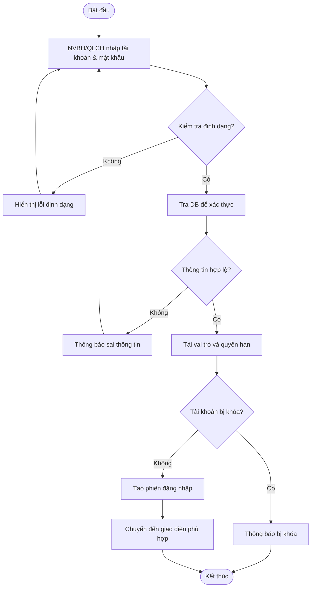

---

## 2) Bán hàng tại quầy (POS Checkout)
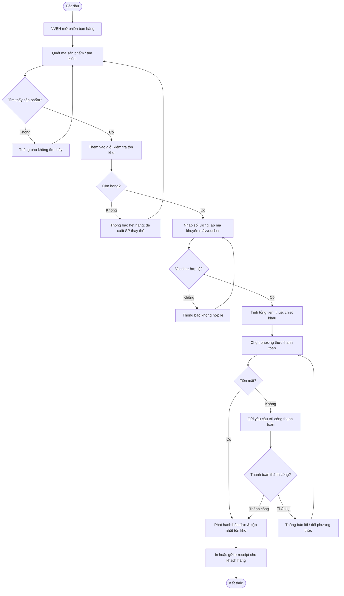

---

## 3) Bán hàng online
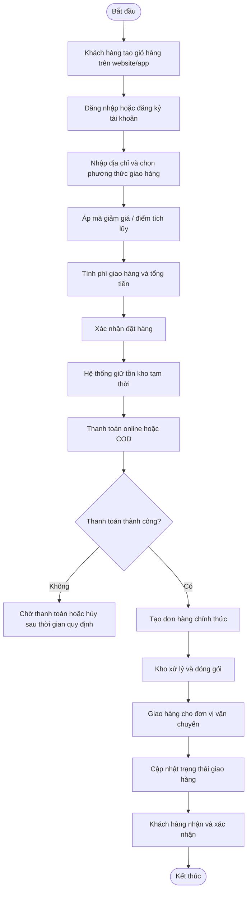

---

## 4) Quản lý sản phẩm
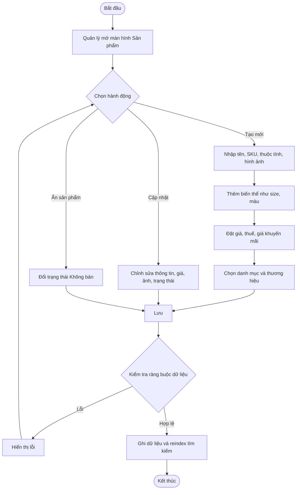

---

## 5) Nhập hàng
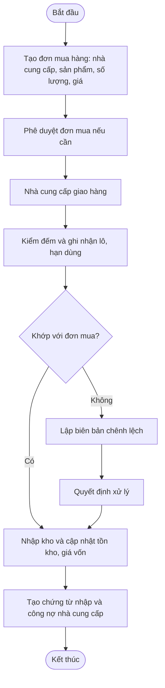

---

## 6) Quản lý tồn kho
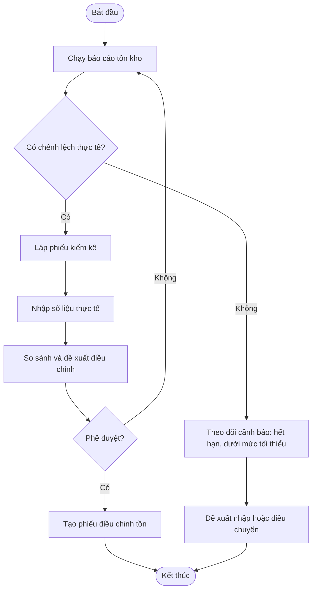

---

## 7) Thanh toán và hoàn tiền
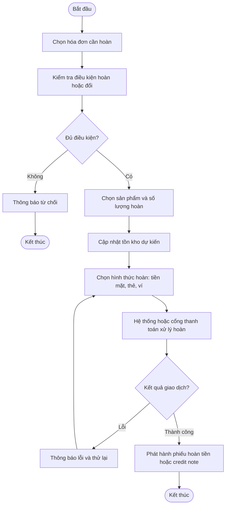

---

## 8) Quản lý khuyến mãi
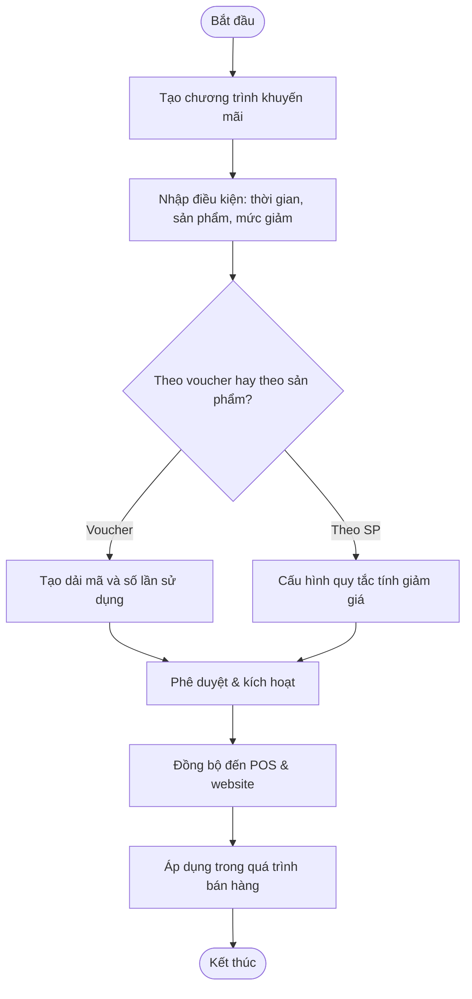

---

## 9) Quản lý khách hàng
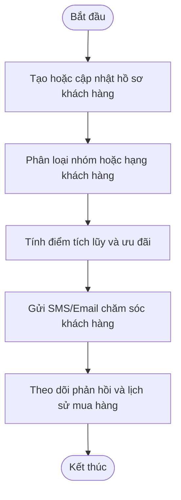

---

## 10) Báo cáo và thống kê
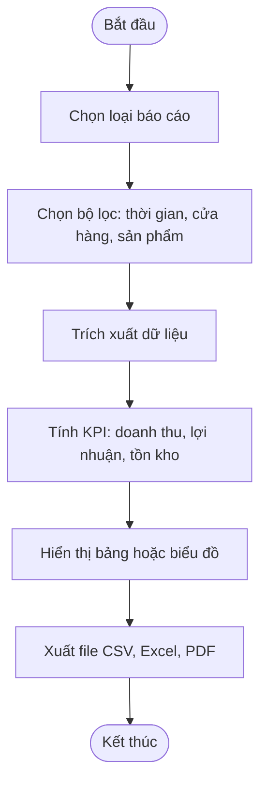

---

## 11) Quản lý nhân viên và ca làm
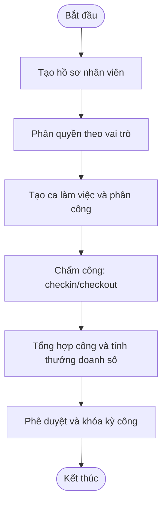

---

## 12) Quản trị hệ thống và danh mục chung
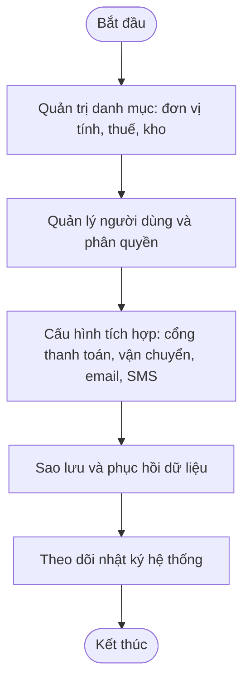
# Class Diagram kết hợp mô hình **ECB** – Hệ thống quản lý cửa hàng **FASHIONLAND**

> Xuất theo **PlantUML** để bạn render trực tiếp. Cấu trúc gồm 3 nhóm: **«boundary»** (UI/adapter), **«control»** (điều phối UC), **«entity»** (miền nghiệp vụ).

```plantuml
@startuml
skinparam shadowing false
skinparam linetype ortho
skinparam classAttributeIconSize 0
skinparam PackageStyle rectangle
skinparam class {
  BackgroundColor<<entity>> LightYellow
  BackgroundColor<<control>> LightBlue
  BackgroundColor<<boundary>> HoneyDew
}

' =================== BOUNDARY ===================
package "Boundary" <<Frame>> {
  class POSUI <<boundary>> {
    +scanBarcode(code)
    +applyVoucher(code)
    +selectPayment(method)
    +printReceipt(orderId)
  }
  class OnlineStoreUI <<boundary>> {
    +browseCatalog(q)
    +checkout(cart)
    +trackOrder(code)
  }
  class AdminPortalUI <<boundary>> {
    +login()
    +manageProducts()
    +managePromotions()
    +reports()
  }
  class PaymentGatewayAdapter <<boundary>> { +pay(amount, method): PaymentResult }
  class ShippingAdapter <<boundary>> { +createShipment(orderId) }
  class NotificationAdapter <<boundary>> { +send(channel, content) }
  class LoyaltyAdapter <<boundary>> { +addPoints(customerId, points) }
}

' =================== CONTROL ===================
package "Control" <<Frame>> {
  class AuthControl <<control>> {
    +authenticate(username, password)
    +assignRoles(userId, roles)
  }
  class ManageProductControl <<control>> {
    +createProduct(...)
    +updateProduct(...)
    +createVariant(...)
    +setPrices(...)
  }
  class PurchaseControl <<control>> {
    +createPO(supplierId, items)
    +receiveGRN(poId, items)
  }
  class InventoryControl <<control>> {
    +adjustStock(sku, qty, reason)
    +warnLowStock()
    +warnNearExpiry()
    +cycleCount(plan)
  }
  class POSCheckoutControl <<control>> {
    +addItem(sku, qty)
    +applyPromotion(orderId)
    +applyVoucher(code)
    +takePayment(orderId, method)
    +finalize(orderId)
  }
  class OnlineOrderControl <<control>> {
    +createOrder(cart, customerId)
    +confirmOnlinePayment(orderId, txn)
    +arrangeShipping(orderId)
  }
  class ReturnExchangeControl <<control>> {
    +createReturn(salesOrderId, items, reason)
    +processRefund(returnId)
    +createExchange(returnId, newItems)
  }
  class CustomerControl <<control>> {
    +classify(customerId)
    +recordFeedback(customerId, content)
    +purchaseHistory(customerId)
  }
  class PromotionControl <<control>> {
    +createCampaign(...)
    +issueVoucher(...)
    +evaluateRules(order)
  }
  class ReportControl <<control>> {
    +revenueReport(range)
    +inventoryReport(range)
    +topSelling(range)
  }
  class UserAdminControl <<control>> {
    +createUser(...)
    +assignRole(userId, role)
    +backup()
    +restore()
  }
}

' =================== ENTITY ===================
package "Entity" <<Frame>> {
  class Category <<entity>> { +id: long +name: String }
  class Brand <<entity>> { +id: long +name: String }
  class Product <<entity>> {
    +id: long
    +name: String
    +description: String
    +basePrice: Decimal
    +status: String
  }
  class ProductVariant <<entity>> {
    +sku: String
    +barcode: String
    +color: String
    +size: String
    +price: Decimal
    +status: VariantStatus
  }
  class Warehouse <<entity>> { +id: long +name: String +location: String }
  class Inventory <<entity>> {
    +id: long
    +sku: String
    +warehouseId: long
    +qtyOnHand: int
    +qtyAvailable: int
    +reorderPoint: int
    +expiryDate: Date?
  }
  class Supplier <<entity>> { +id: long +name: String +taxCode: String +phone: String +email: String }

  class PurchaseOrder <<entity>> {
    +id: long
    +code: String
    +orderDate: Date
    +status: POStatus
    +totalAmount: Decimal
  }
  class POItem <<entity>> { +id: long +sku: String +qtyOrdered: int +unitPrice: Decimal }
  class GoodsReceipt <<entity>> { +id: long +code: String +receivedDate: Date +status: GRNStatus }
  class GRNItem <<entity>> { +id: long +sku: String +qtyReceived: int +lot: String +expiryDate: Date? }

  class Customer <<entity>> { +id: long +code: String +name: String +phone: String +email: String +tier: String }
  class LoyaltyAccount <<entity>> { +id: long +points: int +tier: String }

  class SalesOrder <<entity>> {
    +id: long
    +code: String
    +channel: Channel
    +orderDate: DateTime
    +status: OrderStatus
    +subtotal: Decimal
    +discountTotal: Decimal
    +finalAmount: Decimal
  }
  class SalesItem <<entity>> { +id: long +sku: String +qty: int +unitPrice: Decimal +discount: Decimal }
  class Payment <<entity>> { +id: long +method: PaymentMethod +amount: Decimal +status: PaymentStatus +txnRef: String }

  class ReturnOrder <<entity>> { +id: long +type: ReturnType +reason: String +status: ReturnStatus }
  class ReturnItem <<entity>> { +id: long +sku: String +qty: int +refundAmount: Decimal }

  class PromotionCampaign <<entity>> {
    +id: long
    +name: String
    +type: PromotionType
    +startAt: DateTime
    +endAt: DateTime
    +active: boolean
  }
  class PromotionRule <<entity>> {
    +id: long
    +ruleType: RuleType
    +minAmount: Decimal
    +percent: Decimal
    +fixedAmount: Decimal
    +buyX: int
    +getY: int
  }
  class Voucher <<entity>> { +code: String +value: Decimal +type: VoucherType +expireAt: DateTime +status: String }

  class Employee <<entity>> { +id: long +fullName: String +phone: String }
  class Role <<entity>> { +id: long +name: String }
  class Permission <<entity>> { +id: long +name: String }
  class UserAccount <<entity>> { +id: long +username: String +passwordHash: String +isActive: boolean +lastLoginAt: DateTime }
  class AuditLog <<entity>> { +id: long +at: DateTime +actorId: long +action: String +target: String }

  enum VariantStatus { Active; Inactive }
  enum POStatus { Draft; Submitted; Approved; PartiallyReceived; FullyReceived; Cancelled }
  enum GRNStatus { Draft; Received; Reconciled }
  enum Channel { POS; ONLINE }
  enum OrderStatus { Draft; Confirmed; Paid; Fulfilled; Cancelled; Returned; PartiallyReturned }
  enum PaymentMethod { Cash; Card; QR; EWallet; COD; BankTransfer }
  enum PaymentStatus { Pending; Authorized; Captured; Refunded; Failed }
  enum ReturnType { Return; Exchange }
  enum ReturnStatus { Pending; Approved; Rejected; Refunded; Exchanged }
  enum PromotionType { Percentage; FixedAmount; BuyXGetY; Bundle }
  enum RuleType { OrderLevel; ItemLevel }
  enum VoucherType { Amount; Percent }
  enum StockMoveType { Receipt; Issue; AdjustInc; AdjustDec; TransferIn; TransferOut; ReturnToSupplier; ReturnFromCustomer }
}

' ===== Entity Relationships =====
Product "1" -- "*" ProductVariant : has
ProductVariant "1" -- "*" Inventory : stock
Inventory "*" --> "1" Warehouse
Product "*" --> "1" Brand
Product "*" -- "*" Category

PurchaseOrder "1" -- "*" POItem
POItem "*" --> "1" ProductVariant
GoodsReceipt "1" -- "*" GRNItem
GoodsReceipt --> PurchaseOrder
GRNItem --> ProductVariant

Customer "1" -- "0..1" LoyaltyAccount
SalesOrder "1" -- "*" SalesItem
SalesItem "*" --> "1" ProductVariant
SalesOrder "1" -- "*" Payment
SalesOrder "*" --> "0..1" Customer

ReturnOrder "1" -- "*" ReturnItem
ReturnOrder --> SalesOrder : original
ReturnItem --> ProductVariant

PromotionCampaign "1" -- "*" PromotionRule
Voucher "*" --> "0..1" Customer

UserAccount "1" -- "*" Role
Role "1" -- "*" Permission
Employee "1" -- "1" UserAccount
AuditLog ..> UserAccount

' ===== Control → Entity Dependencies =====
ManageProductControl --> Product
ManageProductControl --> ProductVariant
ManageProductControl --> Category
ManageProductControl --> Brand

PurchaseControl --> PurchaseOrder
PurchaseControl --> POItem
PurchaseControl --> GoodsReceipt
PurchaseControl --> GRNItem
PurchaseControl --> Supplier

InventoryControl --> Inventory
InventoryControl --> Warehouse
InventoryControl --> ProductVariant

POSCheckoutControl --> SalesOrder
POSCheckoutControl --> SalesItem
POSCheckoutControl --> Payment
POSCheckoutControl --> Voucher
POSCheckoutControl --> PromotionCampaign
POSCheckoutControl --> PromotionRule

OnlineOrderControl --> SalesOrder
OnlineOrderControl --> SalesItem
OnlineOrderControl --> Payment
OnlineOrderControl --> Customer
OnlineOrderControl --> Voucher
OnlineOrderControl --> PromotionCampaign

ReturnExchangeControl --> ReturnOrder
ReturnExchangeControl --> ReturnItem
ReturnExchangeControl --> SalesOrder

CustomerControl --> Customer
CustomerControl --> LoyaltyAccount
PromotionControl --> PromotionCampaign
PromotionControl --> PromotionRule
PromotionControl --> Voucher

ReportControl ..> SalesOrder
ReportControl ..> Payment
ReportControl ..> Inventory
ReportControl ..> ProductVariant

UserAdminControl --> UserAccount
UserAdminControl --> Role
UserAdminControl --> Permission
UserAdminControl --> AuditLog

' ===== Boundary → Control =====
POSUI ..> POSCheckoutControl
POSUI ..> ReturnExchangeControl
OnlineStoreUI ..> OnlineOrderControl
AdminPortalUI ..> ManageProductControl
AdminPortalUI ..> PurchaseControl
AdminPortalUI ..> InventoryControl
AdminPortalUI ..> PromotionControl
AdminPortalUI ..> ReportControl
AdminPortalUI ..> UserAdminControl

PaymentGatewayAdapter ..> POSCheckoutControl : pay()
ShippingAdapter ..> OnlineOrderControl : createShipment()
NotificationAdapter ..> OnlineOrderControl : notify()
LoyaltyAdapter ..> CustomerControl : addPoints()

@enduml
```

## Gợi ý mapping Use Case → Control (đối chiếu nhanh)

* **Đăng nhập & phân quyền** → `AuthControl`, `UserAdminControl`, `UserAccount/Role/Permission`.
* **Bán hàng tại quầy (POS)** → `POSCheckoutControl` + `PaymentGatewayAdapter` + `SalesOrder/Payment`.
* **Bán hàng online** → `OnlineOrderControl` + `ShippingAdapter`.
* **Nhập hàng** → `PurchaseControl` + `PurchaseOrder/GoodsReceipt`.
* **Quản lý khuyến mãi/voucher/điểm** → `PromotionControl`, `Voucher`, `PromotionCampaign/Rule`, `LoyaltyAccount`.
* **Báo cáo – thống kê** → `ReportControl` (doanh thu, tồn, bán chạy).

> Nếu cần, mình có thể xuất thêm bản **Mermaid** hoặc chuyển thành **.drawio**.
